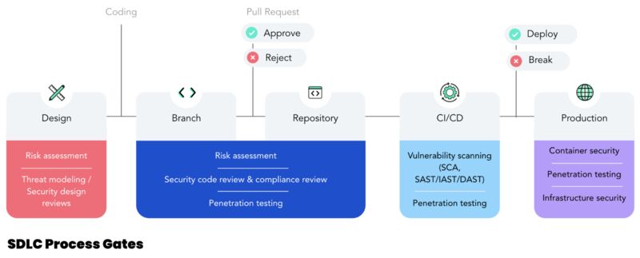
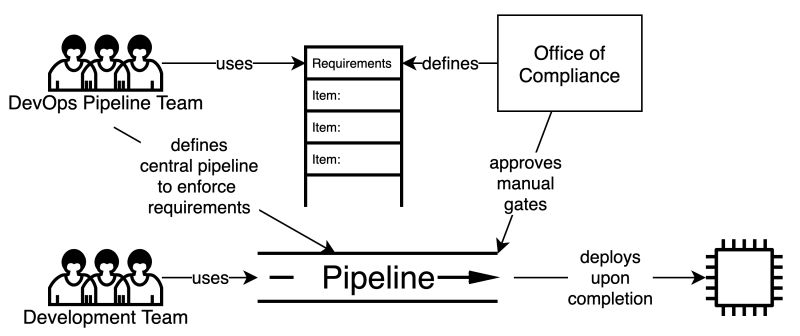

title: DevSecOps

## Secret Management 

### Hashicorp Vault

Hashicorp provide usefull labs for all their products [here](https://play.instruqt.com/hashicorp).

Secrets Management Using Vault in K8S [here](https://medium.com/@pratyush.mathur/secrets-management-using-vault-in-k8s-272462c37fd8)

## Container security

Container security checklist: From the image to the workload [here](https://github.com/krol3/container-security-checklist)

## SLDC

### Frameworks

Interesting: the National Institute of Standards and Technology (NIST) just published a framework for secure development [here](https://csrc.nist.gov/publications/detail/sp/800-218/final)

SAMM provides an effective and measurable way for all types of organizations to analyze and improve their software security posture. This maturity model is maintained by OWASP [here](https://owaspsamm.org)

### AppSec

How to build an AppSec program based on risk: 

{: align=center}

## DevSecOps

### CI/CD threat matrix

Repo - Common Threat Matrix for CI/CD Pipeline [here](https://github.com/rung/threat-matrix-cicd)

List of the top 10 CI/CD security risks [here](https://www.cidersecurity.io/top-10-cicd-security-risks/)

### DevSecOps Gitlab dynamic template management

Dynamic pipeline with Gitlab [here](https://www.objectif-libre.com/fr/blog/2021/02/23/une-nouvelle-ere-pour-gitlab-ci-pipelines-dynamiques/).

How to use include with gitlab [here](https://docs.gitlab.com/ee/ci/yaml/includes.html#use-variables-with-include)

### DevSecOps Guideline

The OWASP DevSecOps Guideline focuses on explaining how we can implement a secure pipeline and using best practices and introduce tools that we can use in this matter [here](https://github.com/OWASP/DevSecOpsGuideline)

Integrating Compliance Controls and Audit into CI/CD Processes [here](https://martinfowler.com/articles/devops-compliance.html)

{: align=center}

### Article

Why DevSecOps is important and what are the benefits? [here](https://bridgecrew.io/blog/building-the-business-case-for-devsecops/?utm_content=191289143&utm_medium=social&utm_source=linkedin&hss_channel=lcp-14836856).

Embed Kubernetes security at each phase of the DevOps lifecycle: [here](https://bridgecrew.io/blog/devops-lifecycle-embedding-kubernetes-security/?utm_content=197951868&utm_medium=social&utm_source=linkedin&hss_channel=lcp-14836856)

10 real-world stories of how we’ve compromised CI/CD pipelines [here](https://research.nccgroup.com/2022/01/13/10-real-world-stories-of-how-weve-compromised-ci-cd-pipelines/amp/)

Shifting Cloud Security Left — Scanning Infrastructure as Code for Security Issues [here](https://www.linkedin.com/feed/update/urn:li:activity:6885570028373078016/?updateEntityUrn=urn%3Ali%3Afs_feedUpdate%3A%28V2%2Curn%3Ali%3Aactivity%3A6885570028373078016%29)

Interisting blog with several articles on DevSecOps from GitGuardian and secrets detection [here](https://blog.gitguardian.com/)

### Infrastructure As Code (IaC)

Fantastic Infrastructure as Code security attacks and how to find them [here](https://about.gitlab.com/blog/2022/02/17/fantastic-infrastructure-as-code-security-attacks-and-how-to-find-them/)

Terraform - 5 ways to create Infrastructure in Multiple Environments [here](https://medium.com/bb-tutorials-and-thoughts/terraform-5-ways-to-create-infrastructure-in-multiple-environments-8a6e3f42a694)

## Secure Coding

This ressource present a lot of best practices regarding application coding. This guide takes into account that many of our developers write integration pieces with the Lightning Platform and includes examples from other web platforms such as Java, ASP.NET, PHP and Ruby [here](https://developer.salesforce.com/docs/atlas.en-us.secure_coding_guide.meta/secure_coding_guide/secure_coding_guidelines.htm)
