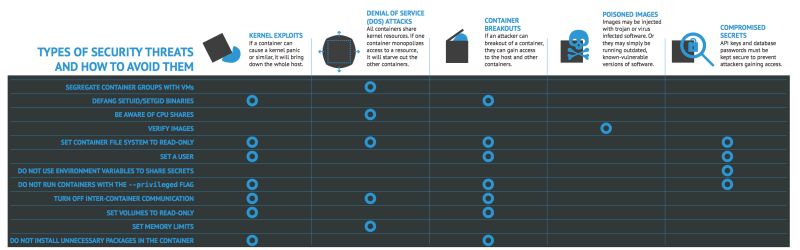

title: Docker

## Docker security

Docker security repository included books, blogs, video, tools and cases. [here](https://github.com/myugan/awesome-docker-security)

### Threat model

A docker threat model is an excellent way to close the security gaps, know what you've got, and understand what you're doing. 

{: align=center}

## Container security

Ressource for Container Security / hardening including the full lifecycle [here](https://github.com/krol3/container-security-checklist)

## Image security

An article on how to make your Docker image more secure [here](https://aws.github.io/aws-eks-best-practices/security/docs/image/)

