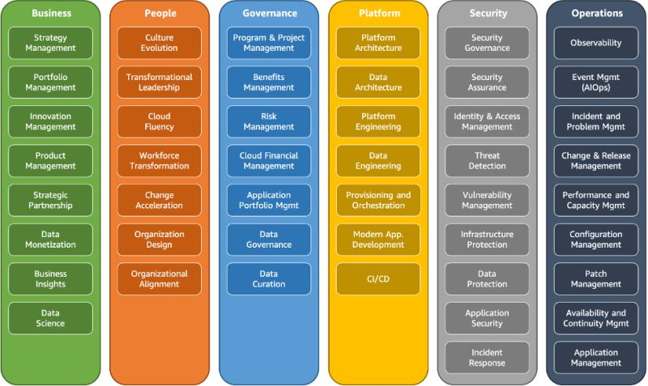
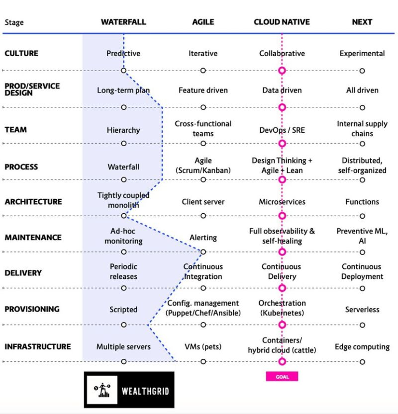

title: Cloud Security

## Cloud Foundations

This is a great overview of AWS's "Cloud Foundations

{: align=center}

## Cloud security ressources

A great place that sum-up useful knowledgebases [here]<https://www.nojones.net/cloud-security-resources>

## Cloud CSPM products

Cloud Security Posture Managementis a class of security tools as defined by Gartner include use cases for infrastructure compliance monitoring, DevOps integration, incident response, risk assessment, and risk visualization.

Product | CSP support, remarks | Link
------------ | ------------- | ------------
Divvy Cloud | AWS, Azure, GCP, Alibaba, Kubernetes | <https://divvycloud.com>
Cloud Custodian | AWS, Azure, GCP. Open Source, good community | <https://cloudcustodian.io>
Palto Alto Prisma Cloud (Redlock) | AWS, Azure, GCP, Alibaba, Kubernetes, Doker, IBM Cloud | <https://www.paloaltonetworks.com/prisma/cloud>
Netflix Security Monkey | AWS, GCP. End of life 2020 | <https://github.com/Netflix/security_monkey>
TurBot | AWS, Azure, GCP | <https://turbot.com>
DisruptOps | ? | <https://disruptops.com>
CheckPoint CloudGuard Dome9 | AWS, Azure, GCP. Some remediations focused primarily on network and IAM | <https://dome9.com>
Aqua CloudSploit | AWS, Azure, GCP, Oracle Cloud | <https://cloudsploit.com>
Trend Micro Cloud Conformity | AWS, (Azure) | <https://www.cloudconformity.com>
Fugue | AWS, Azure | <https://www.fugue.co>
OpenCSPM | ? | <https://github.com/OpenCSPM/opencspm>
Wiz | AWS, Azure, GCP | <https://www.wiz.io>

## Cloud security posture

What to look for when reviewing a company's infrastructure. Very interisting article on how to understand and asses your cloud infrastructure in order to design a cloud security roadmap [here](https://www.marcolancini.it/2022/blog-cloud-security-infrastructure-review/)

A list of question while reviewing the security architecture of a multi-cloud SaaS company [here](https://roadmap.cloudsecdocs.com/infrastructure-review/)

Very interisting blog with Cloud security topics (Kubernetes, docker image security, aws, azure, GCP, etc) [here](https://cloudsecdocs.com/)

How to define a Cloud security roadmap [here](https://roadmap.cloudsecdocs.com/) and [here](https://www.marcolancini.it/cloud-security-strategies/)

How to mitigate cloud vulnerabilities by NSA [here](https://media.defense.gov/2020/Jan/22/2002237484/-1/-1/0/CSI-MITIGATING-CLOUD-VULNERABILITIES_20200121.PDF)

Modern Cloud Governance with a well balanced security / Cost and Business value [here](https://www.chrisfarris.com/post/cloud-gov/)

## Cloud open source tools

RESTler is the first stateful REST API fuzzing tool for automatically testing cloud services through their REST APIs and finding security and reliability bugs in these services. [here](https://github.com/microsoft/restler-fuzzer)

## Maturity matrice

The infographic feature high-level patterns for mapping your company’s technical and strategic transformation.

{: align=center}

This page lists security mistakes by cloud service providers (AWS, GCP, and Azure). These are public mistakes on the cloud providers' side of the shared responsibility model [here](https://github.com/SummitRoute/csp_security_mistakes)

## FinOps

Great eBook that explains the basics of FinOps Whitepaper From FinOps to proven cloud cost management & optimization strategies [here](https://finopsinpractice.org)

Great tool for cost estimation based on terraform and can be integrated in CI/CD pipeline [here](https://github.com/infracost/infracost)

## Network

Good practices on how to segregate a network in Cloud environment [here](https://github.com/sergiomarotco/Network-segmentation-cheat-sheet)

## Whitepapers

A bench of whitepapers from SANS institute [here](https://www.sans.org/white-papers/?msc=main-nav)

Why IAM is a key component in cloud, and what are the threats [here](https://unit42.paloaltonetworks.com/iam-cloud-threat-research/)

## Awareness

This article explains how to create a proactive security & engineering culture with awareness strategy [here](https://medium.com/life-at-chime/monocle-how-chime-creates-a-proactive-security-engineering-culture-part-1-dedd3846127f)

