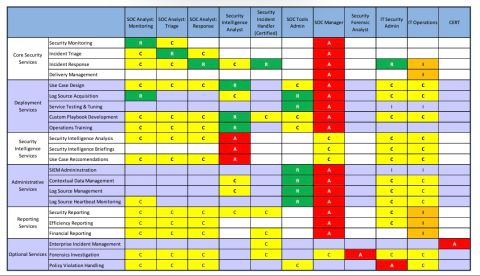

title: Incident & Response

## General

### Playbooks

Public Playbooks - This repository contains all the Incident Response Playbooks and Workflows of Company's SOC [here](https://gitlab.com/syntax-ir/playbooks)

### SOC

SOC Open Source is a project designed for security analysts and all SOC audiences who wants to play with implementation and explore the modern SOC architecture. [here](https://github.com/archanchoudhury/SOC-OpenSource)

SOC Open Source lesson explain [here](https://www.youtube.com/watch?v=t6PqjLIVgdA)

guide for AAD SOC - plenty of useful cross-links - Guide Azure Active Directory security operations guide [here](https://docs.microsoft.com/en-us/azure/active-directory/fundamentals/security-operations-introduction)

### Roles

A #RACI matrix for all #SOC roles ! (By IBM)

### Threat Hunting

A collection of tools and other resources for threat hunters [here](https://github.com/A3sal0n/CyberThreatHunting)

### Learn from incidents

Learning from Cyber Incidents Adapting Aviation Safety Models to Cybersecurity [here](https://www.belfercenter.org/publication/learning-cyber-incidents-adapting-aviation-safety-models-cybersecurity)

## Cloud

### AWS

framework aims to facilitate automated steps for incident response and forensics based on the AWS Incident Response White Paper [here](https://github.com/awslabs/aws-automated-incident-response-and-forensics)

Cloud threat matrix from Mitre Att&ck [here](https://attack.mitre.org/matrices/enterprise/cloud/)

### Multi-cloud

Here is a guide to ensure detection is operational and your logs are managed centrally, in real time, at scale, as-code and for free [here](https://m365internals.com/2021/07/05/why-are-windows-defender-av-logs-so-important-and-how-to-monitor-them-with-azure-sentinel/)
