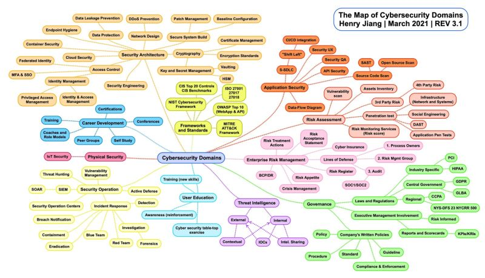

title: General Cybersecurity

## Cybersecurity domains

## Security Posture

In this link you will find a cloud security roadmap template 

<https://roadmap.cloudsecdocs.com/>

In this link you will find an article on how to establish a cloud security program

<https://www.marcolancini.it/2021/blog-cloud-security-roadmap/>

Where to start in securing a medium/big entreprise with CIS <https://tristandostaler.medium.com/cis-controls-where-to-start-in-securing-a-medium-big-enterprise-32679fdacc16>

## AppSec Program

A guide for CISOs and security leaders to enable a business with Application Security and a shift left approach. 

<https://betterappsec.com/cisos-guide-to-a-modern-appsec-program-a6021f52e62d>

## CISO training

Great CISO series for Chief Information Security Officer (CISO) Workshop Training

<https://docs.microsoft.com/en-us/security/ciso-workshop/ciso-workshop?view=o365-worldwide>

## Cybersecurity onepager for Awareness

SecurityZines provider onepager with graphical way of learning concepts of Application & Web security <https://securityzines.com/>

## Cybersecurity career

Valuable overview out, providing a career /certification orientation for young up to experienced professionals in the #Security domain

<https://www.digitalworld.net/sites/default/files/document/2021-02/Cyber%20Security%20%20Professional%20Qualifications.pdf>
