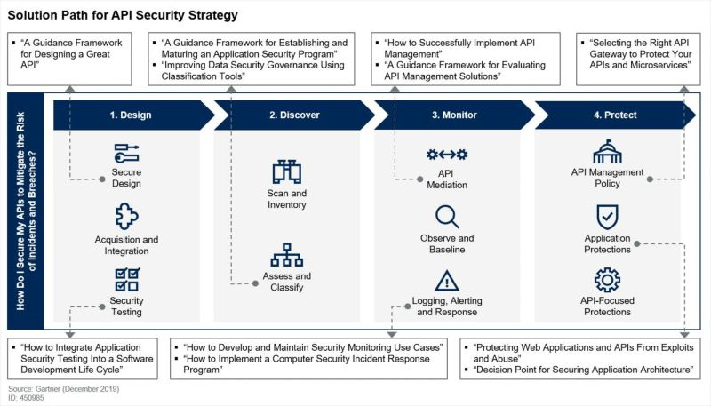

title: Cybersecurity tools

## Eliminating Dangling Elastic IP

When you are deploying infrastructure to AWS, you may spin up EC2 instances which have an IP associated with them. When you create DNS records pointing to these IPs, but forget to remove the DNS records after the EC2 instance has been given a new IP or has been destroyed, you are susceptible to subdomain takeover attacks

<https://blog.assetnote.io/2022/02/13/dangling-eips/>

## API Security

A collection of awesome API Security tools and resources

<https://github.com/arainho/awesome-api-security>

A guide on how to define an API securing strategy: 

API Security Checklist

<https://github.com/shieldfy/API-Security-Checklist>

## AD Security

Interisting tool to audit AD GPOs 

<https://github.com/Group3r/Group3r>

## CISA

The U.S. cybersecurity agency CISA publishes a repository of free tools and services to help organizations detect, mitigate, and respond effectively to malicious attacks

<https://thehackernews.com/2022/02/us-cybersecurity-agency-publishes-list.html>

## Hardening

A collection of awesome security hardening guides, best practices, checklists, benchmarks, tools and other resources.

<https://github.com/decalage2/awesome-security-hardening>

## Forensic

List of malware analysis tools and resources.

<https://github.com/rshipp/awesome-malware-analysis>

## Certificat

Tool that search all public certificat for a domain name

<https://crt.sh/>

Tool that identify when a new request of certificat is done

<https://certificate.transparency.dev/>
